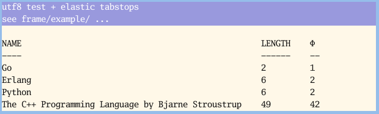

## Frame 
[](https://goreportcard.com/report/github.com/as/frame)

## Synopsis

Package frame provides Plan9-like editable text images. Its API should be familiar to user's of Plan9's libframe, in a manner consistent with Go. 



## Features

- Plain ASCII support
- `NUL` bytes are preserved
- Semantic replacement characters
- UTF8 support 
- Elastic tabstop support


## Description

A Frame draws text onto a given bitmap. It supports efficient rendering of non-linear editing operations and selection tracking.

A `frame` is created using the New function


```
  img := image.NewRGBA(image.Rect(0,0,100,100))
  fr := frame.New(img, img.Bounds(), frame.NewGoMono(), frame.Mono)
```

A frame implements efficient `Rendering`, `Projection`, and `Selection` of text. A selection can also be `Indexed`

### Rendering

Text is rendered with Insert and Delete

```
func (f *Frame) Insert(s []byte, p0 int64) (wrote int)
    Insert renders the slice s at index p0

func (f *Frame) Delete(p0, p1 int64) int
    Delete deletes the range [p0:p1)
```

The two operations are inverses of each other.

```
  fr.Insert([]byte("hello world."), 0)
  fr.Delete(0, 11)
```

`Insert` and `Delete` return the number of characters inserted or deleted.

To `Delete` the last insertion:
```
  p0 := 0
  n := fr.Insert([]byte("123"), p0)
  fr.Delete(p0, p0+n)
```
To execute a traditional "write" operation:

```
  s := []byte("hello")
  fr.Delete(0, int64(len(s)))
  fr.Insert(s, 0)
```

## Projection

Frames translate between 2D points (of say a mouse cursor) to a 1D index (array index) with `IndexOf` and `PointOf`
```
func (f *Frame) IndexOf(pt image.Point) int64
    IndexOf returns the index of pt.

func (f *Frame) PointOf(p int64) image.Point
    PointOf returns the 2D point for index p.
```

They are also inverse operations.

```
  fr.IndexOf(fr.PointOf(5)) // 5
  fr.PointOf(fr.IndexOf(image.Pt(25,25))) // (25, 25)
```

Note that there is no way to extract textual data from the frame with the index. Frame data structures are designed for write-only operation.

## Selection


Frames select a continuous range of text with `Select`. The currently-selected range is queried with `Dot`.


```
func (f *Frame) Select(p0, p1 int64)
    Select selects the region [p0:p1)

func (f *Frame) Dot() (p0, p1 int64)
    Dot returns the selected region [p0:p1)
```

Live selections are done by passing the mouse event pipe into `Sweep`. 
The `flush` func executes the callers upload/publish procedure for the display.
See the examples for more detail.

```
func (fr *Frame) Sweep(ep EventPipe, flush func())

type EventPipe interface {
        Send(e interface{})
        SendFirst(e interface{})
        NextEvent() interface{}
}

```

Sweep is the only method that requires an event pump to cross API boundaries. All other methods can operate on a static `*image.RGBA` without additional consideration.


## Drawing


With a few trivial exceptions (Sweep), this package does not have a runtime
dependency on any rendering libraries. A Frame can use a plain `*image.RGBA`
and write a copy of the updated bitmap to a png file. Most of the graphical
tests in this package are executed in this manner.

Because the bitmap is an arbitrary image and also a living cache of glyphs, drawing
on the bitmap between rendering operations persists on the underlying glyphs. There
are a few ways to re-render the bitmap or a region of it.


```
Recolor(pt image.Point, p0, p1 int64, cols Palette)
  Recolor colors the range p0:p1 by redrawing the foreground, background, and font glyphs

Redraw(pt image.Point, p0, p1 int64, issel bool)
  Redraw redraws the characters between p0:p1. It accesses the cache of drawn glyph widths
  to avoid remeasuring strings

RedrawAt(pt image.Point, text, back image.Image)
  RedrawAt refreshes the entire image to the right of the given pt. Everything below is redrawn.

Refresh()
  Refresh recomputes the state of the frame from scratch. This is an expensive operation compared
  to redraw
```

## Examples

- Basic
https://github.com/as/frame/blob/master/example/basic/basic.go

- UTF-8
https://github.com/as/frame/blob/master/example/utf8/utf8.go

- Elastic
https://github.com/as/frame/blob/master/example/elastic/elastic.go

- Fast (use if you need better performance or have graphical lag)
https://github.com/as/frame/blob/master/example/fast/fast.go

# Note

A frame's text is not addressable. Once the characters are written to the frame, there is no
mechanism to retrieve their position from within the frame. Use a buffer to store text for reading
and the range addresses of the frame to access bytes from that buffer.

See `github.com/as/ui/win` for an example.


## Shiny-specific information

After any frame altering operation, one can be sure that the changes can be written to
the frame's bitmap. However, the same can not be said for the exp/shiny window. There currently
exists an optimization (see github.com/as/drawcache) that caches rectangles that need to be
redrawn to the screen. This is because shiny (or the native drivers used by it) are too slow to
refresh the entire window if that window's resolution is high.

This rendering pipeline is bottlenecked, so an optimization is located between the |*|

```
insert | frame | shiny buffer |*| shiny window
```

## References

http://doc.cat-v.org/plan_9/4th_edition/papers/sam/

Specifically, the section `Data structures in the terminal` served as a guide
